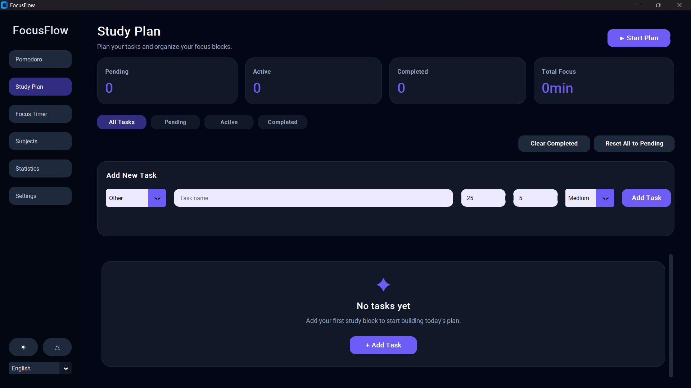
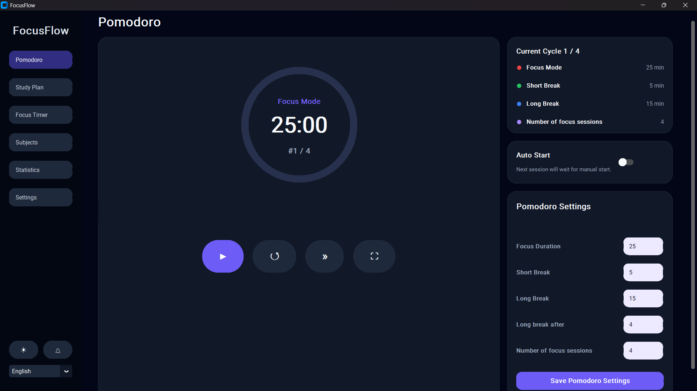
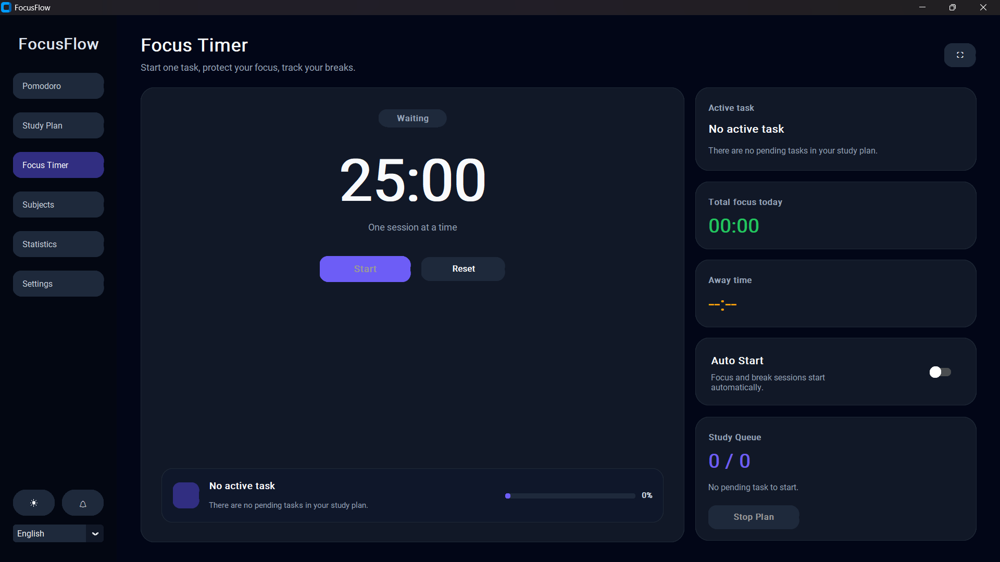
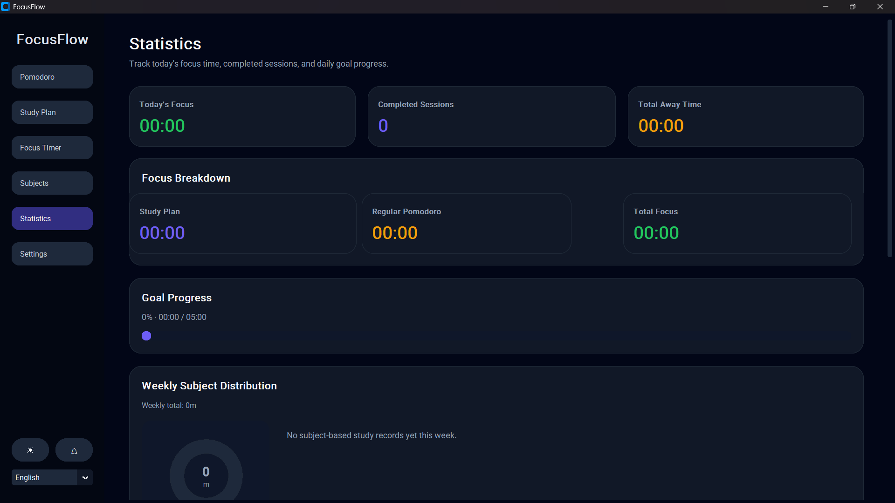

# FocusFlow

<div align="center">

**A modern productivity application for students who want to stay focused and study smarter.**

Study planning • Pomodoro • Focus Timer • Statistics • Multi-language • Windows Desktop

</div>

---

## ✨ Features

### 📋 Study Planner

- Create study tasks
- Drag & drop task ordering
- Task priorities
- Subject categories
- Task queue
- Completed task management

### ⏱️ Pomodoro Timer

- Customizable focus & break durations
- Automatic session switching
- Fullscreen mode
- Configurable alarm sounds
- Alarm dismiss button
- Cycle tracking

### 🎯 Focus Timer

- Stopwatch-style focus mode
- Away time tracking
- Pause & resume
- Weekly statistics integration

### 📊 Statistics

- Weekly study history
- Subject distribution
- Focus vs break analysis
- Completed task tracking
- Excel export

### ⚙️ Settings

- Multiple alarm sounds
- Enable / disable alarms
- Language selection
- Auto-start sessions
- Persistent settings

---

## 🌍 Supported Languages

- 🇺🇸 English
- 🇹🇷 Turkish
- 🇪🇸 Spanish
- 🇫🇷 French
- 🇩🇪 German
- 🇵🇹 Portuguese
- 🇯🇵 Japanese
- 🇨🇳 Simplified Chinese

---

# Screenshots

## Study Planner



---

## Pomodoro Timer



---

## Focus Timer



---

## Statistics



---

## Settings


---

# Installation

Download the latest release from the **Releases** page.

Extract the ZIP archive and run:

```
FocusFlow.exe
```

No installation is required.

---

# Built With

- Python
- CustomTkinter
- PyInstaller
- pygame
- openpyxl

---

# Data Storage

FocusFlow stores user data locally.

```
%LOCALAPPDATA%\FocusFlow\
```

Your study history, settings and statistics remain available after restarting the application.

---

# Project Structure

```
FocusFlow/
│
├── assets/
├── core/
├── locales/
├── sounds/
├── ui/
├── main.py
└── FocusFlow.spec
```

---

## Download

The latest stable version can be downloaded from:

➡️ Microsoft Store *(coming soon)*

or

➡️ GitHub Releases

---

# License

This project is licensed under the MIT License.
